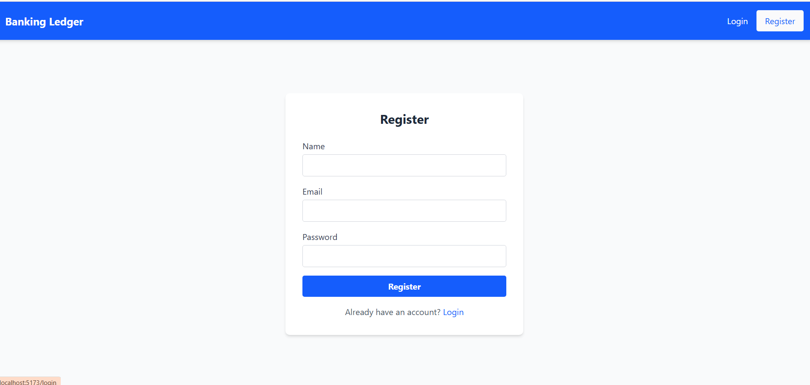
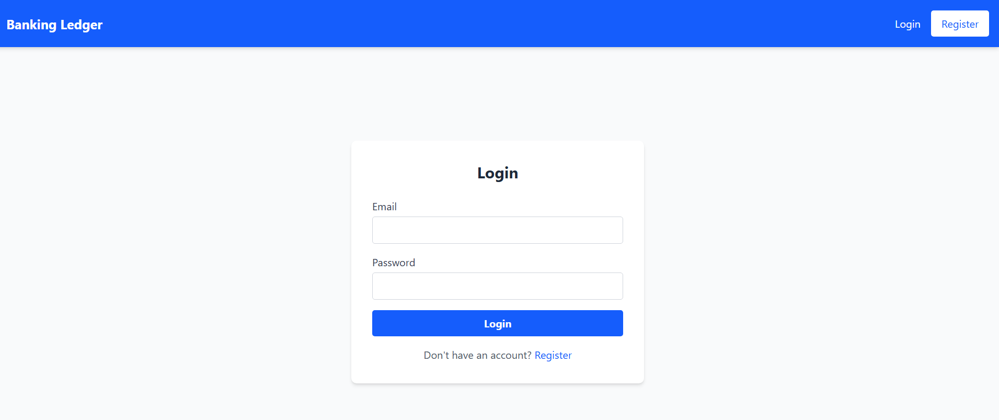
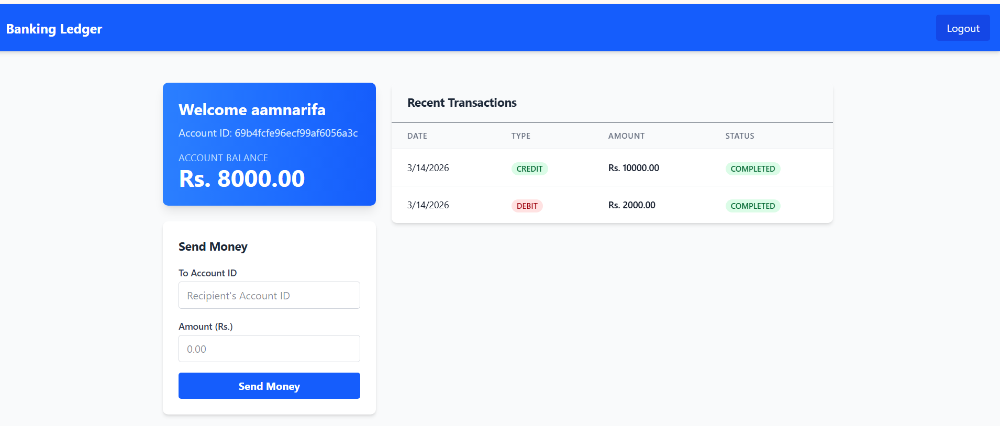

# Banking Ledger System (Backend Developer Assignment)

A full-stack application demonstrating a secure and scalable backend system with authentication, role-based access, and REST APIs, along with a simple frontend UI to interact with the APIs.

This project implements a financial ledger system where users can create accounts, view balances, and perform transactions.

---

## Features

### Backend

- User Registration & Login
- Password hashing using bcrypt
- JWT Authentication
- Role-based access (User / Admin)
- RESTful API design
- API versioning (`/api/v1`)
- Transaction system with double-entry ledger
- Balance derived from ledger entries
- Global error handling
- Modular scalable project structure
- MongoDB database with Mongoose

### Frontend

Simple React dashboard that allows users to:

- Register and log in
- View account balance
- View recent transactions
- Send money to another account
- Display API success / error responses

---

## Tech Stack

### Backend
- Node.js
- Express.js
- MongoDB
- Mongoose
- JWT Authentication
- bcrypt
- Postman (API documentation)

### Frontend
- React (Vite)
- Axios
- React Router
- TailwindCSS

## Project Structure

```

banking-system
│
├── backend
│   ├── src
│   │   ├── config
│   │   ├── controllers
│   │   ├── middleware
│   │   ├── models
│   │   ├── routes
│   │   └── services
│   │
│   ├── app.js
│   └── server.js
│
├── frontend
│   ├── src
│   │   ├── pages
│   │   ├── components
│   │   ├── context
│   │   └── services
│   │
│   └── package.json
│
├── docs
│   ├── dashboard.png
│   ├── login.png
│   ├── register.png
│   ├── Accounts.postman_collection.json
│   ├── authentication.postman_collection.json
│   └── ledger.postman_collection.json
│
└── README.md
```


## Application Screenshots

### Register Page


### Login Page


### Dashboard


## API Endpoints

### Authentication

POST /api/v1/auth/register  
POST /api/v1/auth/login  

### Accounts

GET /api/v1/accounts  
GET /api/v1/accounts/balance/:accountId  

### Transactions

POST /api/v1/transactions  
GET /api/v1/transactions

## Environment Variables

Create a `.env` file inside the **backend** folder.

Example:

```env
PORT=3000
MONGO_URI=your_mongodb_connection
JWT_SECRET=your_secret_key
```

Frontend `.env` file:

```env
VITE_API_BASE_URL=http://localhost:3000/api/v1
```

## Running the Project

### Backend

```bash
cd backend
npm install
npm run dev
```

Server will run on: http://localhost:3000

### Frontend
```bash
cd frontend
npm install 
npm run dev 
```


Frontend will run on: http://localhost:5173


## Postman Documentation

API endpoints are documented in the included **Postman collection**.

Location:


## Security Practices 
-Password hashing using bcrypt 
-jWT authentication 
-Protected routes with middleware 
-Input validation 
-Secure API headers

## Scalability Considerations 

This architecture is designed to scale with future improvements: 
- Redis caching for frequently accessed data 
- Message queues for transaction processing
- Microservices architecture for authentication and transactions
- Horizontal scaling with load balancers 
- Containerization with Docker ---


## Author

Aamna Rifa  
Backend Assignment

